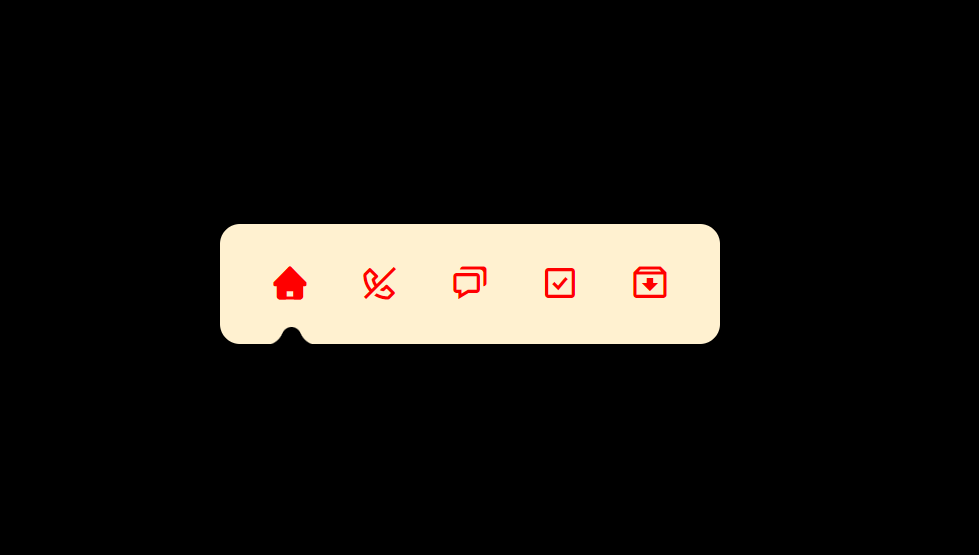

<b>> Página de compra do controle PS5 da loja Playstation</b>
Desenvolvido atraves das aulas do Rodrigo Mori no Youtube.

O projeto foi desenvolvido com as seguintes tecnologias:

- [x] HTML
- [x] CSS
- [x] JavaScript

Resultado: https://gleysiferreira.github.io/Menu-Animado/

## 🤝 Colaboradores

Pessoa que contribuiu para este projeto:

<table>
  <tr>
    <td align="center">
         
        
          <b>Gleysi Ferreira</b>
        
      </a>
    </td>
   </tr>
</table>

